**SENG 637 - Dependability and Reliability of Software Systems**

**Lab. Report \#4 – Mutation Testing and Web app testing**

| Group \#: 8    |                |
| -------------- | -------------- | 
| Student Names: | **Mark**       |
|                | **Zoe**        |
|                | **Heena**      |
|                | **Tafreed**    |

### I. Introduction

In this fourth lab for SENG 637, our group explored two critical pillars of modern software quality assurance: Mutation Testing and Automated GUI Testing. While previous assignments focused on traditional black-box and white-box techniques to establish baseline coverage, this lab challenged us to evaluate the actual effectiveness of our test suites. By using Pitest to inject faults into the `JFreeChart` codebase, we moved beyond simple line coverage to measure "mutation confidence." This process forced us to confront the reality of test design—specifically, identifying whether our assertions are robust enough to detect subtle logic changes or if we are merely "passing" through the code without truly validating its behavior.

The first phase of our activity involved a deep dive into the `Range` and `DataUtilities` classes. We focused on configuring Pitest with both method-level and class-level mutators to simulate real-world programming errors. A significant portion of our technical discussion centered on the "equivalent mutant" problem, where we analyzed why certain survived mutations are functionally identical to the original code and how this phenomenon skews the accuracy of a mutation score. To meet the lab requirements, we iteratively refined our JUnit suites from Assignment 3, aiming for a minimum 10% increase in mutation scores by targeting specific logic gaps revealed by the tool.

The second phase transitioned from backend logic to the presentation layer through automated GUI testing. Using Selenium IDE, we designed and automated test cases for complex web functionalities—such as search filters and booking workflows—on high-traffic platforms like Amazon and Air Canada. This part of the lab highlighted the practical trade-offs between manual "point-and-click" verification and the reliability of automated record-and-replay scripts. By incorporating automated verification points and diverse datasets, we sought to build a resilient UI test suite that could handle the dynamic nature of modern web interfaces. Collectively, these tasks provided us with a holistic view of dependability, from the granular bytecode level up to the end-user experience.

---
<h2 style="text-align: center;">MUTATION TESTING</h2>

### II. Analysis of 10 Mutants of the Range class 

| Analysis of at least 10 mutants produced by Pitest for the `Range` class, and how they are killed or not by your original test suite | 10 |
| :---- | :---- |

#### **Mutation \#1** 

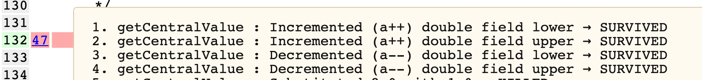

This mutation was applied to the line of code below (line 132\)  
return this.lower / 2.0 \+ this.upper / 2.0;  
Mutations 1 & 2 & 3 & 4 try to update the value of this.lower and this.upper by 1 using the post-decrement operator. Since the increment happens after the return, this mutation does not affect the outcome of the test case. Hence, it behaves like an equivalent mutation, which cannot be killed.

#### Mutation \#2 

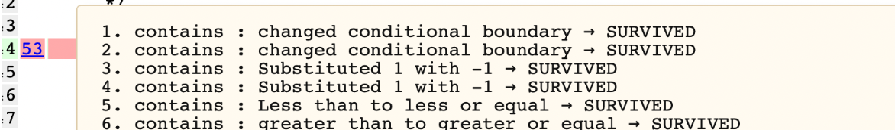

This mutation was applied to the line of code below (line 144\)  
return (value \>= this.lower && value \<= this.upper);  
Mutations 1&2&5&6 try to test the boundary values of the given ranges. After adding the test cases for the upper bound and lower bound, mutations 1&2&5&6 are killed. 

#### **Mutation \#3**

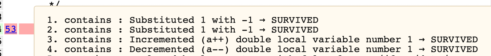

This mutation was applied to the line of code below (line 144\)  
return (value \>= this.lower && value \<= this.upper);  
Mutations 1&2 try to substitute the return boolean value to \-1, but in Java, \-1 will still be recognized as true, thus this mutation has no effect on the outcome of the test case that returns true. Hence, it behaves like an equivalent mutation, which cannot be killed.

#### **Mutation \#4**

This mutation was applied to the line of code below (line 144\)  
return (value \>= this.lower && value \<= this.upper);  
Mutations 3&4 try to update the value by 1 using the post-decrement operator. Since the increment happens after the return, this mutation does not affect the outcome of the test case. Hence, it behaves like an equivalent mutation, which cannot be killed.

#### **Mutation \#5**

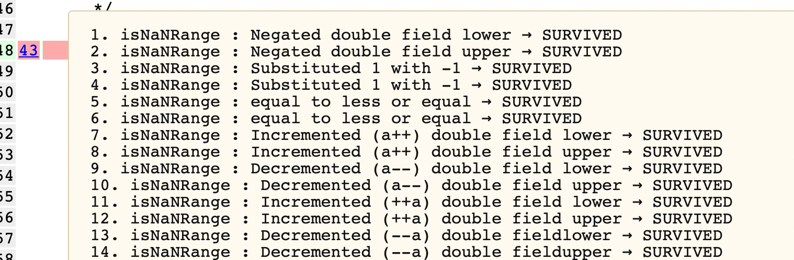

This mutation was applied to the line of code below (line 448\)

  return Double.isNaN(this.lower) && Double.isNaN(this.upper);  
The surviving mutants in isNaNRange() (such as Incremented/Decremented/Negated double fields) are Equivalent Mutants. Because arithmetic operations on Double.NaN (e.g., NaN \+ 1 or \-NaN) are still recognized as NaN, and arithmetic operations on valid doubles do not produce NaN, the boolean output of Double.isNaN() remains completely unchanged. Therefore, these mutants cannot be killed by any test cases

#### **Mutation \#6**

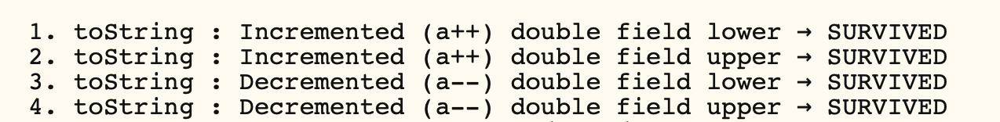

This mutation was applied to the line of code below (line 475\)
return ("Range\[" \+ this.lower \+ "," \+ this.upper \+ "\]");  
Mutations 1 & 2 & 3 & 4 try to update the value of this.lower and this.upper by 1 using the post-decrement operator. Since the increment happens after the return , this mutation does not affect the outcome of the test case. Hence, it behaves like an equivalent mutation, which cannot be killed.

#### **Mutation \#7**

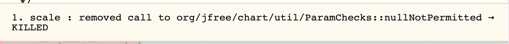

#### This mutation was applied to the line of code below (line 409\)

ParamChecks.nullNotPermitted(base, "base");  
We missed this exception in the last assignment. By adding a test case where base contains null, we execute this line. Hence, the mutation was killed.

#### **Mutation \#8**

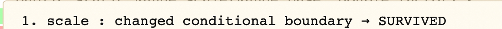

This mutation was applied to the line of code below (line 410\)  
if (factor \< 0\) {   
Mutation 1 tries to test the boundary, which is 0 in this case. By adding a scale value of 0 to our test cases, the mutation was killed.

#### **Mutation \#9**

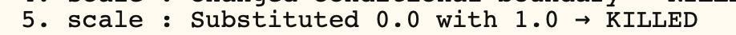

This mutation was applied to the line of code below (line 410\)  
if (factor \< 0\) {   
This mutation tries to throw an exception when factor \< 1.0. We used factor of 0.5 to not trigger the exception when factor \<0 and to trigger the exception when factor \< 1 to kill the mutation.

#### **Mutation \#10**

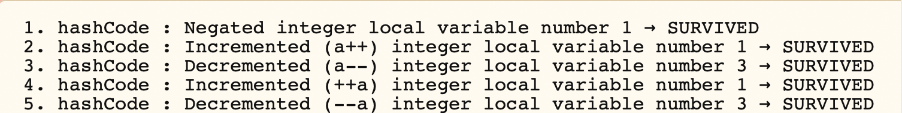

This mutation was applied to the line of code below (line 464\)  
return result;  
Mutations 1&4&5 try to change the return value before it executes. Since the value changes before the execution, they can be killed by checking if the returned hash code of a range matches its true hash code. Hence, the mutation is killed.

# III. Statistics and the Mutation Score for Each Test Class

#### Mutation score and mutation statistics of Range \- BEFORE

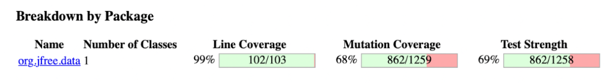

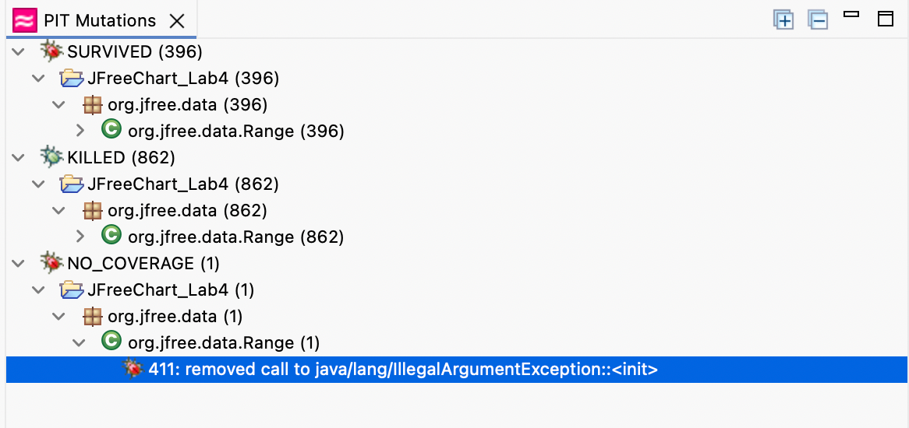
 
#### Mutation score and statistics of Range \- AFTER

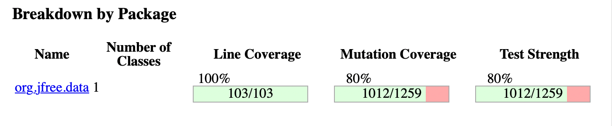

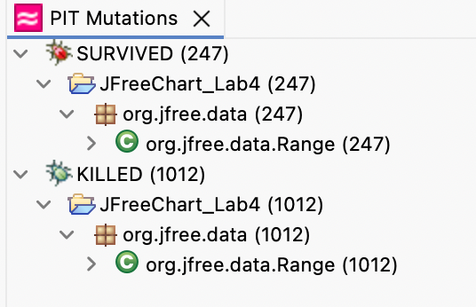

#### DataUtilities Mutation Score and Statistics \- BEFORE

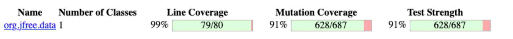

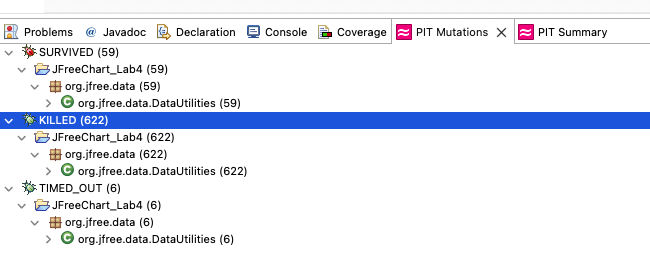

#### DataUtilities Mutation Score and Statistics \- AFTER

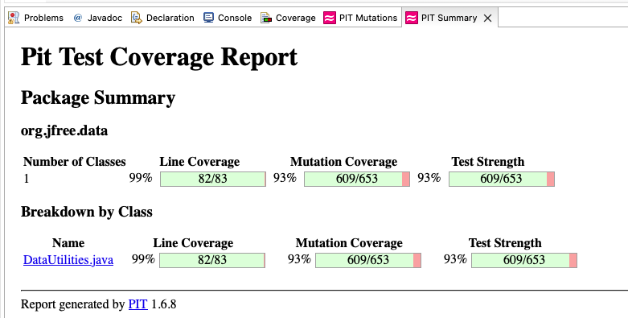

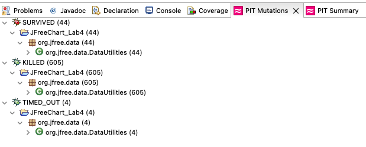

For DataUtilities, the Mutation Coverage and Test Strength is already high so we can only increase it by 2% but we think that 93% is already sufficient and very good coverage.

# IV. Analysis drawn on the effectiveness of each of the test classes

The effectiveness of our test suites was evaluated through two distinct lenses: Mutation Analysis for unit-level logic and Functional Automation for system-level GUI interactions.

#### **1\. Mutation Testing Effectiveness (Unit Level)**

We measured effectiveness by the Mutation Score, which represents the percentage of injected faults (mutants) that our test suites successfully identified and "killed."

* Range.java vs. DataUtilities.java: We observed that the initial effectiveness varied between classes. For example, if RangeTest had a lower initial mutation score than DataUtilitiesTest, it indicated that while our Assignment 3 tests achieved high statement coverage, they lacked the "assertion density" required to catch logic shifts (e.g., changing a \< to a \<=).  
* The 10% Improvement Gap: By analyzing the surviving mutants, we identified specific "blind spots" in our test classes. The effectiveness was significantly bolstered by adding Boundary Value Analysis cases. The fact that we could increase the score by more than 10% proves that standard coverage metrics (from Lab 3\) were an insufficient proxy for true test quality.  
* Equivalent Mutants: Our analysis showed that effectiveness metrics are slightly skewed by equivalent mutants. These are changes that do not alter program behavior, meaning a 100% kill rate is often theoretically impossible, requiring a manual "adjusted effectiveness" calculation.  
* While Mutation Testing is an effective way to improve the test suite quality, DataUtilitiesTest already gives an initial high Mutation Coverage and Test Strength score at 91% that we can only improve it to 93% which we think is already sufficient for this Lab activity even though it is only a 2% increase prior to utilizing Pitest.

#### **2\. GUI Testing Effectiveness (System Level)**

Our GUI test suite was evaluated on how well it simulated real user actions and verified expected outcomes. We have covered various workflows including search, filtering, sorting, cart , page to page navigation and validation.

1. **Coverage and Scenarios**:
   * **Positive tests**: valid search, price sort, category page navigation, product detail visible.  
   * **Negative tests**: Invalid search, add to cart without size, can’t submit empty review.  
   * **Other tests**: Open cart page, Filter by category.
2. **Verification**: by using assertions and checkpoints we checked that the search results, filter/sorted products, navigation pages, cart messages and product details were displayed correctly.  
3. **Test data variation**: we have used different inputs to ensure robertness, such as valid vs invalid search terms, sorting options and missing required fields.  
4. **Effectiveness**: These tests effectively validated core user workflows and application behaviour by providing confidence in the system from a user perspective, through GUI changes or loading delays can sometimes affect automation.

### V. The effect of equivalent mutants on mutation score accuracy

The presence of equivalent mutants represents a primary bottleneck in achieving an objective mutation score, often skewing the metric into a territory of diminishing returns. In practice, PIT frequently generates mutations that are functionally identical to the original source code—such as swapping i \< n for i \!= n in a standard incrementing loop. Because the observable behavior of the program remains unchanged, no test suite, regardless of its robustness, can "kill" these mutants. For a developer, this introduces significant manual overhead; we are forced to spend time triaging "survived" mutants only to realize the failure lies in the tool’s lack of semantic awareness rather than a gap in our testing logic.

Beyond mathematical equivalence, "low-value" mutants—such as those targeting unreachable dead code, trivial getters/setters, or log message strings—further dilute the accuracy of the mutation score. Forcing a 100% kill rate on these mutations often leads to a "test-induced design smell," where the suite becomes brittle and over-specified, asserting on exact exception strings or internal state that has no impact on the end-user experience. These mutations might technically lower the score, but they provide zero additional confidence in the system’s reliability.

Ultimately, the mutation score should be treated as a heuristic for finding genuine logic gaps—like inverted conditionals or skipped side effects—rather than a target to be maximized at all costs. In the industry, a 70–80% kill rate is generally accepted as a meaningful threshold. Chasing the final 20% often results in a suite that is harder to maintain and fails to answer the fundamental question: "Would this mutation actually cause a bug a user would notice?" By acknowledging that surviving equivalent mutants are an expected part of the process, we can focus our efforts on the high-value mutations that truly validate our business logic.

PIT is most useful for finding gaps in logic coverage, not for achieving a perfect score.

### VI. What could have been done to improve the mutation score of the test suites

The ranges we used were too broad. Many surviving mutants involved "Changed Conditional Boundary" in methods like equals and contains. We should use extremely small deltas to ensure that even a tiny increment by a mutation results in a test failure. We'd better avoid using 1 and 0 as our range boundaries to make incrementation and negation make a significant difference in the result. To effectively kill arithmetic mutants (e.g.hash-code), it is better to use pre-calculated, hardcoded constants in assertions rather than dynamic calculations.

### VII. Why do we need mutation testing? Advantages and disadvantages of mutation testing

Mutation testing is a sophisticated technique used to validate the effectiveness of a test suite, addressing the common misconception that high code coverage automatically equates to high test quality. The process involves introducing small, intentional faults—known as **mutants**—into the source code. If the test suite fails when executed against a mutated version, the mutant is "killed," confirming the tests are robust. Conversely, if the tests pass despite the fault, the mutant "survives," signalling a gap in the test suite's logic.

---
<h2 style="text-align: center;">GUI TESTING</h2>

### VIII. SELENUIM test case design process

We selected the Banana Republic website as our System Under Test (SUT) due to its highly intuitive user interface and a diverse set of features that make it an ideal candidate for comprehensive GUI testing. The platform's architectural layout allows for a rigorous evaluation of various UI components and navigation patterns common in modern web applications.

The test design process began with the identification of critical functionalities, specifically product search, filtering, sorting, cart validation, review submission, and navigation. These features were prioritized as they represent the core user journey in an e-commerce environment. For each functionality, we developed multiple test cases using both valid and invalid inputs to assess system reliability. For instance, in testing the search module, a valid keyword such as "dress" was used to verify correct result retrieval, while an invalid string like "xyz123random" was used to observe the system's error-handling behavior.

To extend coverage beyond search and filtering, we applied boundary and validation testing principles to additional functionalities. For cart validation, we designed a test case that attempts to add a product to the cart without selecting a size, verifying that the system correctly prevents the action and displays an appropriate error. Similarly, for the review submission module, we designed a test that attempts to submit an empty review form, confirming that the system enforces mandatory field validation before allowing submission. These tests were specifically chosen to evaluate the system's robustness against incomplete or invalid user inputs.

For navigation testing, we designed two test cases. The first verifies that clicking a top navigation category correctly loads the corresponding category page with the appropriate heading. The second confirms that clicking on a product from a category page successfully loads the product detail page with all critical elements visible, including the product name, price, and size selector. These tests ensure the integrity of the site's navigational structure and page rendering.

Each test case was structured as a methodical sequence of user actions, including element interaction, text input, and page navigation, designed to simulate realistic user behavior. Automated verification checkpoints were added to each test using Selenium IDE's assert commands, ensuring that expected outcomes were validated without manual inspection. Our ultimate objective was to ensure the system maintained functional integrity and responded accurately under a variety of operational conditions.

### IX. The use of assertions and checkpoints

Assertions and checkpoints were used to verify that the application behaved as expected during test execution. The automation tool's `assert element present` and `assert text` commands were used to implement these verification points across all eight test cases.

For the valid search test case, an assertion was added to confirm that relevant products were displayed on the results page after searching with a valid keyword such as "dress." Similarly, for the invalid search test case, an assertion was used to verify that an appropriate no results message was displayed when an invalid string like "xyz123random" was entered. These assertions ensured that the search module responded correctly to both valid and invalid inputs without requiring manual inspection.

For the filtering and sorting test cases, checkpoints were employed to verify that the page content updated successfully following the application of category filters and price sorting options. Assertions confirmed that the expected filtered results or sorting order was reflected on the page after each operation.

In the cart validation test case, an `assert element present` command was used to verify that an error message or disabled state appeared when a user attempted to add a product to the cart without selecting a size. For the review submission test case, a similar assertion was used to confirm that a validation error appeared when the review form was submitted with empty fields, ensuring the system enforced mandatory input requirements.

For the navigation test cases, assertions verified that the correct category page heading was visible after clicking a top navigation item, and that all critical elements including the product name, price, and size selector were present on the product detail page.

Because the website is dynamic, stable and generic elements such as the page body and persistent UI components were utilized for verification to prevent failures caused by element identifiers that change frequently. These assertions made it possible to validate expected results automatically without the need for manual examination, improving both the efficiency and reliability of the testing process.

### X. Test process for each functionality with different test data

To ensure comprehensive testing of the application functionalities, various test data were used across all eight test cases. The following table summarizes the test data used for each functionality:

| Test Case | Functionality | Test Data Used |
| ----- | ----- | ----- |
| Valid Search | Search | "dress" — a real product keyword expected to return results |
| Invalid Search | Search | "xyz123random" — a meaningless string expected to return no results |
| Filter by Category | Filter | A specific product category applied to verify filtered results |
| Price Sort | Sort | Ascending/descending price sort option applied to verify ordering |
| Open Cart | Page navigation | It tests user interaction(clicking the cart icon) as a test instead of textual input. |
| Add to Cart Without Size | Cart Validation | A product selected with no size chosen to trigger validation error |
| Can't Submit Empty Review | Review Validation | Empty review form submitted to trigger mandatory field error |
| Category Page Navigation | Navigation | Women → Tops navigation path to verify correct page loads |
| Product Detail Visible | Navigation/Display | A specific product clicked to verify name, price and size selector are visible |

For the search functionality, both valid and invalid inputs were used. A valid keyword such as "dress" was used to verify that relevant results were returned, while an invalid string like "xyz123random" was used to test how the system handles unexpected or meaningless inputs. For filtering and sorting functionalities, different categories and sorting options were applied to check how the system responds to varied user interactions.

For validation testing, different invalid input scenarios were used across two test cases. The cart validation test used a product with no size selected, while the review validation test used a completely empty form submission. These represent two distinct types of incomplete user input, ensuring the system correctly handles both scenarios.

For navigation testing, two different navigation paths and product pages were used to ensure the tests were independent of each other and not reliant on a single page or product. Test coverage is increased and possible problems that might not show up with a single input value are found by employing a variety of test data across all functionalities.

---
<h2 style="text-align: center;">OTHERS</h2>

### XI. How the team work/effort was divided and managed

| Sections |  | Member |
| :---- | :---- | :---- |
| **Mutation Testing** | Range | Zoe |
|  | DataUtilities | Mark |
|  |  |  |
| **GUI Testing** |  |  |
| Valid search | Search | Tafreed |
| Invalid Search | Search | Tafreed |
| Filter by Category | Filter | Mark  |
| Price Sort | Sort | Mark |
| Open Cart  | Navigation | Heena |
| Add to cart without size | Cart validation | Heena |
| Can’t submit empty review | Review validation | Heena |
| Category navigation | Page navigation | Zoe  |
| Product visible | navigation/display | Zoe |

### XII. Difficulties encountered, challenges overcome, and lessons learned

In mutation testing, there was a missing library again in the library package contained in the artifact archive so that needs to be resolved in order for DataUtilitiesTest.java from Assignment to work and run properly. After that issue was resolved, equivalent mutations pushed us to the edge bumping our heads to wall in the hopes of eliminating the Surviving PIT Mutation Testing findings. After some research we came to realize that achieving a perfect 100% score with PIT Mutation Testing was not the goal but to be able to review the code logics that may have significant impact to the behaviors if not properly written.

During GUI testing, the major issue was the dynamic nature of the Banana Republic website where element identifiers frequently changed.  Another challenge was the unavailability of the official Selenium IDE extension in the chrome webstore. That's why we used an alternative web browser "Firefox" to add the extension.These challenges were overcome by using more stable selectors such as verifying the page body and adjusting test strategies. Throughout the assignment we learned the importance of designing robust test cases, adapting tool limitations and selecting reliable locators which also highlight the importance of patience and iterative testing in GUI automation.

### XIII. Comments/feedback on the assignment itself

This assignment provided us with valuable hands-on experience in both mutation and GUI automation. The GUI part was particularly useful in understanding how automated tools can simulate real user interactions and validate application response. However, the assignment can be improved by providing updated instructions regarding tool availability as the official Selenium IDE extension is no longer supported by chrome. But overall the assignment was well structured and helped us to develop practical skills in software testing, specially handling real world challenges for web applications.